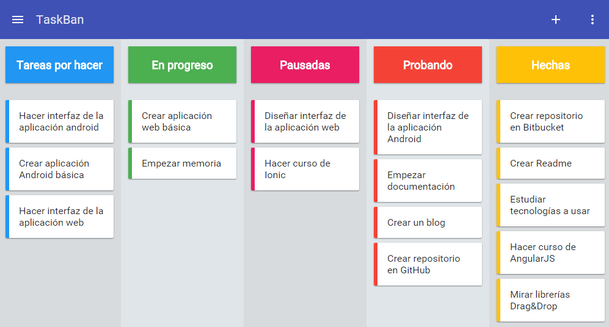

## TaskBan
***
TaskBan is a kanban board web application made with **AngularJS**, **NodeJS**, **ExpressJS** and **MongoDB**, using libraries such as [*Angular Material*](https://material.angularjs.org/latest/) for enhance the user interface and [*Dragula*](http://bevacqua.github.io/angular-dragula/) for the drag and drop.



> This is a work in progress

### Requirements

If you want to test the application, follow the steps below:

* Install and configure *NodeJS*, *MongoDB* and *npm*.
* Do a ``npm install`` to install the dependencies.
* Create a ``config.js`` file like the following:
```
module.exports = {
	development: {
		db: 'mongodb://localhost:27017/kanbanDB',
		secret: 'yoursecret',
		url: 'http://localhost:8080',
		port: process.env.PORT || 8080,
		email: 'yourmail@gmail.com',
		password: 'yourmailpassword'
	}
}
```
* Set the NODE_ENV variable to *development*.
* Start the web application with ``node server.js``.

### License
```
    Copyright (C) 2016 Juan José Granadilla Manzano

    This program is free software: you can redistribute it and/or modify
    it under the terms of the GNU General Public License as published by
    the Free Software Foundation, either version 3 of the License, or
    any later version.

    This program is distributed in the hope that it will be useful,
    but WITHOUT ANY WARRANTY; without even the implied warranty of
    MERCHANTABILITY or FITNESS FOR A PARTICULAR PURPOSE.  See the
    GNU General Public License for more details.
```
